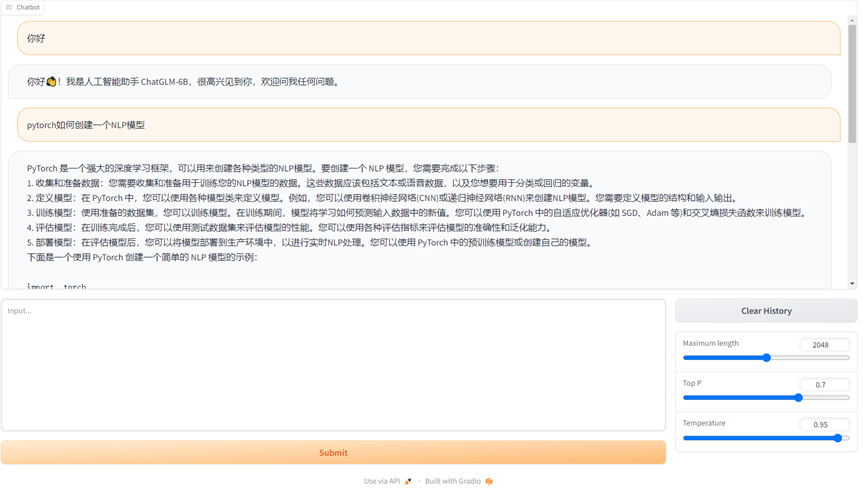
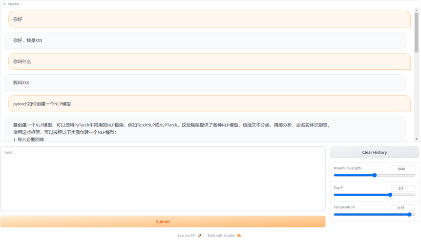

# chatglm-lora

## 教程
* 按[Accelerate](https://huggingface.co/docs/accelerate/v0.18.0/en/quicktour#launching-your-distributed-script)执行`accelerate config`，根据自己的机器配置好yaml，也可以直接修改`accelerate_config.yaml`，其中单机多卡仅修改`num_processes`为GPU个数即可
* 将`data_example.jsonl`换为自己的数据，一行为一个session对话，array中多个对象为多轮，单个对象为单轮
* 若显存不足，可考虑使用`Zero3`(修改`ds_config.json`文件)，具体参考[Deepspeed](https://www.deepspeed.ai/)


## 运行
若通过`accelerate config`生成默认yaml即执行
```
accelerate launch chatglm_lora.py
```
若通过修改`accelerate_config.yaml`来配置节点信息则执行
```
accelerate launch --config_file accelerate_config.yaml chatglm_lora.py
```

## Example效果示例
数据如`data_example.jsonl`所示
```
[{"q": "你好", "a": "你好，我是XXX"}, {"q": "你叫什么名字", "a": "我叫XXX"}]
[{"q": "你好", "a": "你好，我是XXX"}, {"q": "你是谁", "a": "我是XXX"}]
[{"q": "你好", "a": "你好，我是XXX"}, {"q": "你叫什么名字", "a": "我叫XXX"}]
[{"q": "你好", "a": "你好，我是XXX"}, {"q": "你是谁", "a": "我是XXX"}]
```
ChatGLM LoRa前

ChatGLM LoRa后
